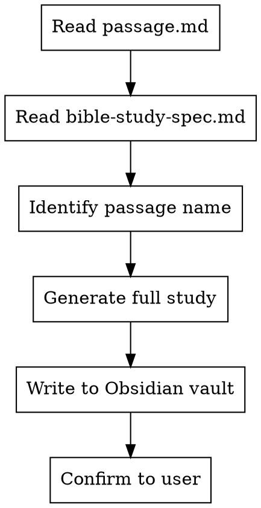
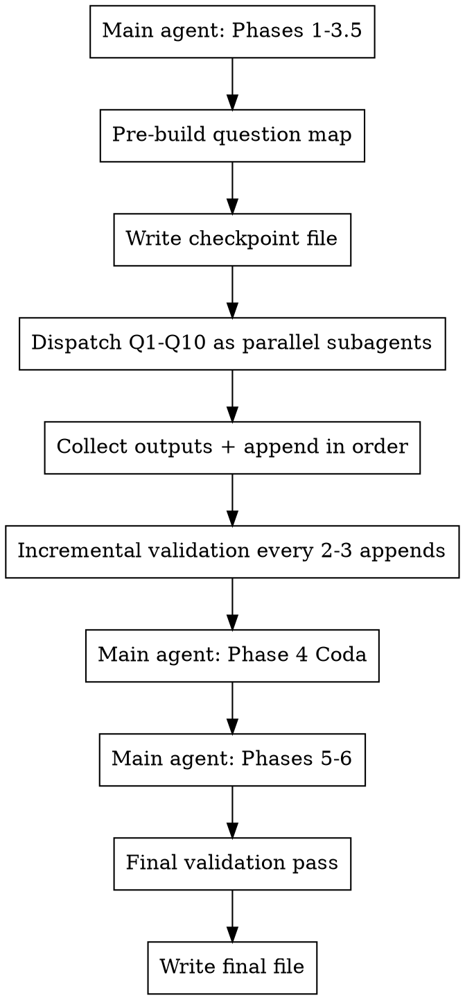

# Bible Study Generator

## Overview

Generate a comprehensive, multi-voice scholarly Bible study from a passage file and a detailed template spec. Output is an Obsidian-ready Markdown file with Excalidraw diagram. Studies follow a 6-phase methodology (plus Phase 3.5 and Phase 4 Coda) with 186+ contemporary theological voices across diverse traditions.

## When to Use

- User says "bible study", "study [passage]", "generate a study"
- User asks to run the bible study workflow
- User puts a new passage in `passage.md` and wants a study generated

---

## Free Scholarly Tool Integration

These free tools replace the need for Logos, Accordance, or other paid Bible software. Reference them actively throughout generated studies and include 🔧 Free Tool Note callouts so the user can independently verify findings.

### STEP Bible (stepbible.org)

**What:** Three-level lexical depth (simple definition → scriptural usage → ancient Greek literary usage), Strong's numbers, morphological analysis, interlinear views, 50+ language translations. Developed by scholars at Tyndale House, Cambridge.
**URL:** `https://www.stepbible.org/?q=version=ESV|reference=[Book].[Chapter]&options=HVGUN`
**Phase mapping:** Phase 1 (translation comparison, key term identification), Phase 3 (lexical analysis, semantic range)
**Advantage over Blue Letter Bible:** Three-level lexical system shows how Greek words were used across ALL ancient Greek literature, not just the Bible — equivalent to what Logos charges for with BDAG.

### Perseus Digital Library (perseus.tufts.edu)

**What:** LSJ lexicon (Liddell-Scott-Jones — academic standard for classical Greek, broader than biblical-only BDAG), full texts of Josephus, Philo, Apostolic Fathers in Greek with English translations, morphological parsing.
**URLs:**

- Greek word: `https://www.perseus.tufts.edu/hopper/morph?l=[greek_word]&la=greek`
- Josephus/Philo: `https://www.perseus.tufts.edu/hopper/collection?collection=Perseus:collection:Greco-Roman`
  **Phase mapping:** Phase 3 (ancient literature parallels — Josephus, Philo, pseudepigrapha context), Phase 3.5 (historical hermeneutical audit — patristic source verification), Phase 4 (Jewish interpretive voices via primary sources)
  **Key value:** Provides ancient parallels that Logos/Accordance charge hundreds of dollars for. When referencing what Josephus or Philo said about a topic, cite the specific Perseus URL.

### NET Bible / Lumina (netbible.org)

**What:** 60,000+ translator's notes explaining textual variants, alternative renderings, manuscript evidence, and translation reasoning. Side-by-side original language display.
**URL:** `https://netbible.org/bible/[Book]+[Chapter]`
**Phase mapping:** Phase 1 (textual criticism alongside 11 translations), Phase 3 (manuscript tradition data, variant documentation)
**Key value:** The translator's notes are essentially a free textual criticism commentary. Reference specific note numbers when discussing variants.

### Bible Hub (biblehub.com)

**What:** Parallel translations, interlinear Greek/Hebrew with parsing, commentaries (Ellicott, Cambridge, Pulpit), Strong's concordance.
**URL:** `https://biblehub.com/interlinear/[book]/[chapter].htm`
**Phase mapping:** Phase 1 (rapid parallel comparison), Phase 3 (commentary cross-checking)

### Academic Open Access

- **JSTOR Open Access:** Many progressive scholar articles freely available
- **Academia.edu:** Scholar-posted preprints and working papers
- **Google Scholar:** Locating specific scholarly positions for Phase 4 voices
- **Bible Odyssey (bibleodyssey.org):** SBL-sponsored accessible scholarship

### Tool Usage Protocol

When generating a study, Claude Code should:

1. **Phase 1:** Include STEP Bible URLs for key Greek terms with three-level analysis. Include NET Bible note references for textual variants.
2. **Phase 3:** Include Perseus URLs for Josephus/Philo parallels. Cite LSJ definitions alongside BDAG/Thayer's.
3. **Phase 3.5:** Reference Perseus for patristic source verification when available.
4. **Phase 4:** Note which scholar positions are verifiable via open-access sources.
5. **Throughout:** Embed `🔧 Free Tool Note:` callouts directing the user to verify independently.

Example callout:

```markdown
🔧 **Free Tool Note:** Verify τυφλός (typhlos) parsing at STEP Bible → stepbible.org → search John 9:1 → click the Greek word for three-level lexical depth. Compare with LSJ entry at Perseus: perseus.tufts.edu/hopper/morph?l=tuflos&la=greek
```

---

## Narrative Lectionary 2025-26 (Year 4 — John)

The user's congregation follows the **Narrative Lectionary** (not RCL as primary). Year 4 is John-focused. When generating a study for any passage in this schedule, note the NL code, title, and where it falls in the year's narrative arc. This context should appear in the YAML frontmatter.

**Structural notes:**

- Fall (Sept–Nov): OT texts are PRIMARY preaching texts; gospel readings are optional/accompanying
- Advent 4 through Easter: Gospel of John becomes PRIMARY
- Post-Easter: Acts and Epistles (Philippians this year)
- Accompanying readings in parentheses are OPTIONAL

### Schedule

| Date    | Code  | Title                              | Primary Text                     | Accompanying          |
| ------- | ----- | ---------------------------------- | -------------------------------- | --------------------- |
| Sept 7  | NL401 | Creation by the Word               | Genesis 1:1–2:4a                 | (John 1:1-5)          |
| Sept 14 | NL402 | Binding of Isaac                   | Genesis 21:1-3; 22:1-14          | (John 1:29)           |
| Sept 21 | NL403 | Jacob's Dream                      | Genesis 27:1-4, 15-23; 28:10-17  | (John 1:50-51)        |
| Sept 28 | NL404 | God's Name Is Revealed             | Exodus 2:23-25; 3:1-15; 4:10-17  | (John 8:58)           |
| Oct 5   | NL405 | God Provides Manna                 | Exodus 16:1-18                   | (John 6:51)           |
| Oct 12  | NL406 | God Calls Samuel                   | 1 Samuel 3:1-21                  | (John 20:21-23)       |
| Oct 19  | NL407 | God Calls David                    | 1 Samuel 16:1-13; Psalm 51:10-14 | (John 7:24)           |
| Oct 26  | NL408 | Solomon's Temple                   | 1 Kings 5:1-5; 8:1-13            | (John 2:19-21)        |
| Nov 2   | NL409 | God Speaks to Elijah               | 1 Kings 19:1-18                  | (John 12:27-28)       |
| Nov 9   | NL410 | Amos: Justice Rolls Down           | Amos 1:1-2; 5:14-15, 21-24       | (John 7:37-38)        |
| Nov 16  | NL411 | Isaiah: A Child Is Born            | Isaiah 9:1-7                     | (John 8:12)           |
| Nov 23  | NL412 | Jeremiah's Letter to Exiles        | Jeremiah 29:1, 4-14              | (John 14:27)          |
| Nov 30  | NL413 | Daniel                             | Daniel 3:1, [2-7] 8-30           | (John 18:36-37)       |
| Dec 7   | NL414 | Valley of Dry Bones                | Ezekiel 37:1-14                  | (John 11:25-26)       |
| Dec 14  | NL415 | Word Accomplishes God's Purpose    | Isaiah 55:1-13                   | (John 4:13-14)        |
| Dec 21  | NL416 | Word Made Flesh                    | John 1:1-18                      | (Psalm 130:5-8)       |
| Dec 24  | NL417 | Birth of Jesus                     | Luke 2:1-14 [15-20]              | (Psalm 96:7-10)       |
| Dec 25  | NL418 | Shepherds Visit                    | Luke 2:8-20                      | (Psalm 123:1-2)       |
| Dec 28  | NL419 | A Voice in the Wilderness          | John 1:19-34                     | (Psalm 32:1-2)        |
| Jan 4   | NL420 | Jesus Says Come and See            | John 1:35-51                     | (Psalm 66:1-5)        |
| Jan 11  | NL421 | Wedding at Cana                    | John 2:1-11                      | (Psalm 104:14-16)     |
| Jan 18  | NL422 | Jesus Cleanses the Temple          | John 2:13-25                     | (Psalm 127:1-2)       |
| Jan 25  | NL423 | Nicodemus                          | John 3:1-21                      | (Psalm 139:13-18)     |
| Feb 1   | NL424 | Woman at the Well                  | John 4:1-42                      | (Psalm 42:1-3)        |
| Feb 8   | NL425 | Healing Stories                    | John 4:46-54 [5:1-18]            | (Psalm 40:1-5)        |
| Feb 15  | NL429 | The Man Born Blind                 | John 9:1-41                      | (Psalm 27:1-4)        |
| Feb 18  | NL430 | The Good Shepherd (Ash Wed)        | John 10:1-18                     | (Psalm 23)            |
| Feb 22  | NL431 | Jesus Raises Lazarus               | John 11:1-44                     | (Psalm 104:27-30)     |
| Mar 1   | NL432 | Jesus Washes Feet                  | John 13:1-17                     | (Psalm 51:7-12)       |
| Mar 8   | NL433 | Peter's Denial                     | John 18:12-27                    | (Psalm 17:1-7)        |
| Mar 15  | NL434 | Jesus and Pilate                   | John 18:28-40                    | (Psalm 145:10-13)     |
| Mar 22  | NL435 | Jesus Condemned                    | John 19:1-16a                    | (Psalm 146)           |
| Mar 29  | NL436 | The Crucified Messiah              | John 19:16b-22                   | (Psalm 24)            |
| Apr 2   | NL437 | Jesus' Last Words (Maundy Thurs)   | John 19:23-30                    | (Psalm 26:3)          |
| Apr 3   | NL438 | Jesus the Passover Lamb (Good Fri) | John 19:31-42                    | (Psalm 31:9-18)       |
| Apr 5   | NL439 | Resurrection                       | John 20:1-18                     | (Psalm 118:21-29)     |
| Apr 12  | NL440 | Thomas                             | John 20:19-31                    | (Psalm 145:13-21)     |
| Apr 19  | NL441 | Paul's Conversion                  | Acts 9:1-19a                     | (Matthew 6:24)        |
| Apr 26  | NL442 | Paul and Silas                     | Acts 16:16-34                    | (Luke 6:18-19, 22-23) |
| May 3   | NL443 | Paul's Sermon at Athens            | Acts 17:16-31                    | (John 1:16-18)        |
| May 10  | NL444 | Partnership in the Gospel          | Philippians 1:1-18a              | (Luke 9:46-48)        |
| May 17  | NL445 | The Christ Hymn                    | Philippians 2:1-13               | (Luke 6:43-45)        |
| May 24  | NL446 | Pentecost                          | Acts 2:1-21; Phil 4:4-7          | (John 14:16-17)       |

### NL Worship Resources Reference

The Narrative Lectionary provides worship resources (prayers and hymns) for each week. When generating a study for an NL passage, include the Prayer of the Day and suggested hymns in Phase 5 (Application Planning — Worship Connection). Hymn abbreviations: ELW (Evangelical Lutheran Worship), GG (Glory to God/Presbyterian), H82 (Hymnal 1982/Episcopal), NCH (New Century Hymnal/UCC), UMH (United Methodist Hymnal), TFF (This Far by Faith).

For the user's UCC context, prioritize NCH numbers when available, followed by ELW (most comprehensive coverage in the NL resources), then UMH and H82.

The full worship resources document is available in the project files. Key data for the current stretch of the lectionary year:

| Code                   | Prayer Theme                                            | Key Hymns                                                                                         |
| ---------------------- | ------------------------------------------------------- | ------------------------------------------------------------------------------------------------- |
| NL429 (Feb 15)         | "God of vision, remove barriers...help us be light"     | Oh, Wondrous Image (ELW 316, NCH 184); Christ, Be Our Light (ELW 715); Beautiful Savior (ELW 838) |
| NL430 (Feb 18 Ash Wed) | "Good shepherd gave his life...gratitude for sacrifice" | Forgive Our Sins (ELW 605); Abide with Me (ELW 629, NCH 99)                                       |
| NL431 (Feb 22)         | "Renew and restore to new life"                         | Glory of These Forty Days (ELW 320); I Am the Bread of Life (ELW 485); Jesus Is a Rock (ELW 333)  |
| NL432 (Mar 1)          | "Service and compassion"                                | Jesus, Priceless Treasure (ELW 775, NCH 480); God, Whose Giving (ELW 678, NCH 565)                |
| NL433 (Mar 8)          | "Like Peter, we turn our backs...show us a new way"     | What Wondrous Love (ELW 666); Guide Me Ever (ELW 618)                                             |
| NL434 (Mar 15)         | "Show us how to follow your truth"                      | Jesus Calls Us (ELW 696, NCH 171); Change My Heart (ELW 801)                                      |
| NL435 (Mar 22)         | "Help us recognize you revealed in Jesus"               | I Want Jesus to Walk with Me (ELW 325, NCH 490); Praise the One Who Breaks the Darkness (ELW 843) |
| NL436 (Mar 29 Palm)    | "Together we cry Hosanna"                               | My Song Is Love Unknown (ELW 343, NCH 222); All Glory, Laud, and Honor (ELW 344, NCH 216)         |

### YAML Frontmatter for NL Passages

When the passage being studied appears in the Narrative Lectionary schedule, add this block to the YAML frontmatter:

```yaml
narrative_lectionary:
  year: "Year 4 (John)"
  code: "NL429"
  title: "The Man Born Blind"
  date: "2026-02-15"
  liturgical_week: "Transfiguration of Our Lord"
  liturgical_color: "White"
  accompanying_text: "Psalm 27:1-4"
  arc_position: "Epiphany series — Jesus as light/revelation, building toward Lent"
  previous: "NL425 — Healing Stories (John 4:46-54)"
  next: "NL430 — The Good Shepherd (John 10:1-18, Ash Wednesday)"
```

---

## Obsidian Vault Integration

### Bible Linker Plugin

The user's vault uses **Bible Linker**. When cross-references appear in a study, use embed syntax for full-text rendering:

```markdown
![[John 9#1]]
![[John 9#2]]
![[John 9#3]]
```

**Rules:**

- FULL book names only: `Genesis` not `Gen`, `1 Corinthians` not `1 Cor`
- Format: `![[Book Chapter#Verse]]` for embed, `[[Book Chapter#Verse]]` for inline link
- Each verse in a range gets its own embed line
- Numbered books use space: `1 Samuel`, `2 Kings`, `1 John`

### Dataview Integration

The YAML frontmatter in generated studies enables Dataview queries in Obsidian. The user can create dashboard notes with queries like:

```dataview
TABLE biblical_book, chapter_verse, study_date
FROM "Areas/Bible Study"
WHERE contains(tags, "acts")
SORT study_date DESC
```

```dataview
LIST
FROM "Areas/Bible Study"
WHERE contains(tags, "womanist") OR contains(tags, "liberation")
```

```dataview
TABLE narrative_lectionary.code AS "NL Code", narrative_lectionary.title AS "Title", narrative_lectionary.date AS "Date"
FROM "Areas/Bible Study"
WHERE narrative_lectionary.code != null
SORT narrative_lectionary.date ASC
```

To support these queries, ensure YAML frontmatter always includes:

- `tags` array with lowercase book name, key themes, and tradition names when a tradition is particularly prominent
- `biblical_book` and `chapter_verse` as separate fields
- `narrative_lectionary` block when applicable
- `key_greek_terms` array for studies with significant original language work

### Recommended YAML Tags for Bible Studies

Always lowercase. Include as applicable:

- Book: `acts`, `john`, `genesis`, `philippians`, etc.
- Themes: `healing`, `justice`, `resurrection`, `temple`, `identity`, `persecution`, etc.
- Methodology: `6-phase-methodology`, `multi-perspectival`
- Lectionary: `narrative-lectionary`, `nl429`, etc.
- Traditions engaged: Only tag when a tradition is notably prominent, e.g., `womanist`, `liberation`, `postcolonial`, `disability-theology`

### Vault File Structure

```
your vault/
└── Areas/
    ├── Bible Study/
    │   ├── Acts/
    │   │   ├── Acts 13.md
    │   │   ├── Acts 15.md
    │   │   └── ... through Acts 28.md
    │   ├── John/
    │   │   ├── John 1.md
    │   │   └── ...
    │   └── [Other Books]/
    └── Sermon Notes/
        ├── 2026-02-01.md
        ├── 2026-02-08.md
        └── ...
```

---

## Workflow



## File Locations

| File               | Path                                                                            |
| ------------------ | ------------------------------------------------------------------------------- |
| Passage text       | `$VAULT_DIR/Areas/Bible Study/<Book>/passage.md` (assemble it from the vault's `Bible/<translation>/<Book>/` notes when it doesn't exist yet) |
| Template/spec      | This file: the study structure, phases, and validation sections below are the spec; no separate spec file exists on this machine |
| Obsidian vault     | `$VAULT_DIR/`                                        |
| Completed examples | Finished studies under `$VAULT_DIR/Areas/Bible Study/<Book>/` |

## Steps

1. **Read the passage** from `passage.md`. This contains the passage text in multiple translations (TOJB2011, TPT, AMP, CJB, FNV, MSG, NRSVue, NMV, TLV, NABRE, WMB, and others).

2. **Read the template** from `bible-study-spec.md`. This is an RTF-encoded file containing the full system prompt and template structure. Parse past the RTF encoding to extract the instructions. Strip `\uc0\uXXXXX` sequences and `{\rtf1...}` wrapper when reading.

3. **Identify the passage name** from the passage text (e.g., "Acts 28", "Romans 3"). Use this for the filename and all `{{PassageName}}` placeholders.

4. **Generate the complete study** following the spec exactly — see Study Structure below.

5. **Write the output** to the Obsidian vault at `$VAULT_DIR/Areas/Bible Study/{Book}/{PassageName}.md`. Create the `{Book}` subdirectory if it doesn't exist.

6. **Confirm** the file was written and its location.

---

## Subagent-First Workflow (Preferred for Phase 4)

Phase 4 questions are the largest part of the study (each ~400-500 lines with full voice matrix). Use parallel subagents for ALL questions at once to ensure consistency and maximize throughput.

### Workflow



### Dispatch Strategy

Launch **all questions as parallel subagents in a single wave** — one agent per question. This keeps voice coverage and format consistent across the whole study, since every agent works from the same prompt template at the same time.

**Question count by chapter length:**

- Short chapters (< 20 verses): 7-8 questions
- Medium chapters (20-35 verses): 8-9 questions
- Long chapters (35+ verses): 9-10 questions

**After dispatch:**

- Collect outputs and append in question order — Q1 first, Q2 second, never reordered
- Run incremental validation every 2-3 appends rather than waiting for the full assembly

### Subagent Prompt Requirements

Each subagent prompt MUST include:

1. **The question text** with full theological framing
2. **Relevant verse context** from the passage
3. **The Format Reference Template** (see below) — exact heading styles, emoji markers, structure
4. **The complete voice category list** with explicit instruction: "Include ALL categories, 2-4 sentences per voice"
5. **All 11 Bible translations** explicitly listed: "Textual evidence MUST cite: TPT, AMP, NRSVue, NMV, TOJB2011, TLV, CJB, MSG, NABRE, FNV, WMB"
6. **Hermeneutical tag requirement**: "Tag EVERY contemporary voice with `[ALEX]`, `[ANT]`, `[AUG]`, `[REF]`, `[WES]`, `[HC]`, `[LIB]`, `[NAR]`"
7. **Pope Leo XIV** (not Pope Francis) — "Catholic section references Pope Leo XIV (Robert Prevost, elected May 2025)"
8. **Target length**: "400-500 lines minimum per question"
9. **Free tool callouts**: "Include at least one 🔧 Free Tool Note per question directing the user to STEP Bible, Perseus, or NET Bible for verification of a key claim, Greek term, or historical parallel"
10. **Bible Linker syntax**: "All cross-references use `![[Book Chapter#Verse]]` with FULL book names — never abbreviations"

### Format Reference Template (Include in Every Subagent Prompt)

```markdown
### Question N: [Question Title]

> **[Sharp thesis answer in 2-4 sentences]**

#### Textual Evidence

- **TPT**: [citation with verse reference]
- **AMP**: [citation with verse reference]
- **NRSVue**: [citation with verse reference]
- **NMV**: [citation with verse reference]
- **TOJB2011**: [citation with verse reference]
- **TLV**: [citation with verse reference]
- **CJB**: [citation with verse reference]
- **MSG**: [citation with verse reference]
- **NABRE**: [citation with verse reference]
- **FNV**: [citation with verse reference]
- **WMB**: [citation with verse reference]

#### Key Language Notes

[Hebrew/Greek terms with transliteration and meaning]

#### Historical-Cultural Notes

[2-4 bullets of relevant historical/cultural context]

#### Canonical + Intertextual Links

[Cross-references with brief explanations]

#### Application

- **Personal**: [specific application]
- **Community/Church**: [specific application]
- **Civic/Public**: [specific application]

#### Contemporary Voices

##### Biblical Scholarship & Academia

- **Dan McClellan** `[HC]`: [2-4 sentences]
- **Walter Brueggemann** `[HC/LIB]`: [2-4 sentences]
  [...every voice in this category]

##### Progressive Christianity & Emergent Voices

[...every voice]

##### Contemplative & Mystical Tradition

[...every voice]

##### Liberation Theologies

**Black Liberation:**
**Womanist:**
**Mujerista/Latinx:**
**Feminist:**
**Mainline Liberationist:**

##### Queer & LGBTQ+ Affirming Theology

[...every voice]

##### Catholic & Orthodox Perspectives

- **Pope Leo XIV** `[AUG]`: [2-4 sentences]
  [...every voice]

##### Global Majority & Post-Colonial Voices

##### Indigenous & Decolonizing Theology

##### Bridge Voices (Charismatic -> Progressive)

##### Progressive Pentecostal & Critical Charismatic

##### Peace Church & Anabaptist Tradition

##### House Church & Organic Church

##### Disability & Embodiment Theology

##### Creation Spirituality & Ecological Theology

##### Practical Theology & Ministry Leadership

##### Homiletics & Preaching

##### Liturgical & Sacramental Theology

##### Integration: Faith & Mental Health

##### Evangelical (Thoughtful/Non-Problematic)

##### Science & Faith Integration

##### Interfaith Dialogue & Comparative Religion

##### Public Theology & Cultural Engagement

##### Cultural & Narrative Theology

##### Classic Christian Apologetics & Literature

##### Movement Analysis & Critique

##### Traditional Charismatic & Apostolic Voices

#### Historical & Patristic Voices

[Apostolic/Sub-Apostolic, Patristic, Medieval, Reformation — with tradition tags]

#### Problematic Voices (For Discernment)

[Each category with "how they might read it" + "risk flags"]

#### Jewish Traditions

#### Christian Interpretive Schools

#### Islamic and Other Faiths

#### 🔧 Free Tool Verification

> 🔧 **Free Tool Note:** [Specific direction to STEP Bible, Perseus, or NET Bible for verifying a key claim, Greek term, or historical parallel from this question. Include URL.]

---
```

### Pre-Build Question Map (Required Before Generation)

Before generating any Phase 4 content, write the complete question map as a planning artifact. This prevents mid-generation scope drift and ensures balanced coverage of the chapter.

**Format — write this directly into the study file as a comment block or into a checkpoint file:**

```markdown
<!-- QUESTION MAP
Q1: [Title] | vv. X-Y | Key term: [Greek/Hebrew] (Strong's) | Tension: [focal question]
Q2: [Title] | vv. X-Y | Key term: [Greek/Hebrew] (Strong's) | Tension: [focal question]
...
Q8: [Title] | vv. X-Y | Key term: [Greek/Hebrew] (Strong's) | Tension: [focal question]
-->
```

**Rules for the question map:**

- Every verse in the chapter must be covered by at least one question
- No question should span more than 6 verses (split if needed)
- Each question identifies ONE focal Greek/Hebrew term
- The "tension" is the interpretive crux — the thing scholars disagree about
- Questions should progress through the chapter in verse order
- Tag questions by weight: `[LIGHT]` (1-2 verses), `[STANDARD]` (3-4 verses), `[HEAVY]` (5-6 verses)

### Question-Weight Scaling

Not all questions require the same depth. Scale target length by verse coverage:

| Verse Count | Weight   | Target Lines  | Notes                                                  |
| ----------- | -------- | ------------- | ------------------------------------------------------ |
| 1-2 verses  | LIGHT    | 400-450 lines | Floor for any question                                 |
| 3-4 verses  | STANDARD | 450-500 lines | Default size                                           |
| 5-6 verses  | HEAVY    | 500-600 lines | Extended textual evidence, more translation divergence |

**All questions still require the full voice matrix** — scaling affects the depth of textual evidence, historical-cultural notes, and application sections, not the number of voice categories.

**400-500 lines is the minimum, not the target range.** A question that comes back under 400 lines is thin regardless of how few verses it covers — send it back rather than accepting it.

### File Assembly Rules

1. **Always add a blank line before appending**: When concatenating subagent output to the file, ensure a newline separates sections. Use `echo "" >> file && cat content >> file` to prevent `---###` concatenation bugs.
2. **Append in question order**: Q1 first, Q2 second, etc. Don't reorder.
3. **Verify each append**: After each append, check the last few lines to confirm clean concatenation.

### Subagent Output Extraction

Background subagents output JSONL format. To extract the generated markdown:

```python
import json
with open(output_file, 'r') as f:
    lines = f.readlines()
for line in reversed(lines):
    data = json.loads(line.strip())
    msg = data.get('message', {})
    content_val = msg.get('content', '')
    if isinstance(content_val, list):
        for item in content_val:
            if isinstance(item, dict) and 'text' in item:
                text = item['text']
                # Filter for real content (>10000 chars) vs placeholder versions
                if 'Question' in text and len(text) > 10000:
                    idx = text.find('### ')
                    content = text[idx:]
                    # Write to temp file for appending
```

**Critical**: Always filter for `len(text) > 10000` to skip placeholder/abbreviated versions that subagents sometimes emit before the full version.

---

## Validation Protocol

### Incremental Validation (Run Every 2-3 Questions)

Don't wait until all questions are assembled. After every 2-3 questions are appended, run a quick check:

```bash
# Quick incremental check after appending Q[N]
FILE="path/to/study.md"
echo "=== Incremental check after Q$N ==="
echo "Line count: $(wc -l < "$FILE")"
echo "Questions so far: $(grep -c '### Question' "$FILE")"
echo "Hermeneutical tags: $(grep -oE '\[(ALEX|ANT|AUG|REF|WES|HC|LIB|NAR)\]' "$FILE" | wc -l)"
echo "Pope check: Leo=$(grep -c 'Pope Leo XIV' "$FILE") Francis=$(grep -c 'Pope Francis' "$FILE")"
echo "Concat bugs: $(grep -c '---###' "$FILE")"
echo "Translation coverage in latest question:"
TRANSLATIONS="${TRANSLATIONS:-TPT AMP NRSVue NMV TOJB2011 TLV CJB MSG NABRE FNV WMB}"  # the active list; override per project
for t in $TRANSLATIONS; do
  echo "  $t: $(tail -200 "$FILE" | grep -c "$t")"
done
```

**Fix immediately** if any check fails — don't accumulate errors across the append sequence.

### Final Validation Checklist (Run After Full Assembly)

After assembling the complete file, run these checks:

1. **All project translations per question**: Grep for each translation in the active translation list (see "Bible Translations Used" section — default: TPT, AMP, NRSVue, NMV, TOJB2011, TLV, CJB, MSG, NABRE, FNV, WMB; or the project-level override) and confirm presence in every question's Textual Evidence section
2. **Hermeneutical tags**: Count `[ALEX]`, `[ANT]`, `[AUG]`, `[REF]`, `[WES]`, `[HC]`, `[LIB]`, `[NAR]` per question — each should have 40+ tags
3. **Pope Leo XIV**: Confirm "Pope Leo XIV" appears, "Pope Francis" does not
4. **No concatenation bugs**: Grep for `---###` or `---####` — should return 0 results
5. **All questions present**: Grep for `Question 1:` through `Question N:` (where N matches the question map count — typically 7-10)
6. **Voice category coverage**: Each question should have 25+ H5 (`#####`) section headings
7. **No placeholders**: Grep for `{{`, `[2-4 sentence`, `[interpretation]` — should return 0
8. **Consistent heading format**: All questions should use `##### ` (H5) with emoji markers for voice categories
9. **Phase completeness**: Confirm Phase 1, 2, 3, 3.5, 4, 4 Coda, 5, 6 all present
10. **Excalidraw JSON**: Confirm the JSON block exists at the end
11. **Free Tool Notes**: Grep for `🔧` — should appear minimum 5 times (Phase 1 key terms, Phase 3 lexical, Phase 3 parallels, Phase 3.5 patristic, at least 1 in Phase 4). Zero occurrences = fail.
12. **STEP Bible references**: Grep for `stepbible.org` — should appear in Phase 1 (key terms table) and Phase 3 (lexical analysis). Minimum 2 occurrences.
13. **NET Bible references**: Grep for `netbible.org` — should appear in Phase 1 (textual variants). Minimum 1 occurrence.
14. **Perseus references**: Grep for `perseus.tufts.edu` — should appear in Phase 3 when Josephus/Philo parallels exist. Required for NT passages; optional for OT.
15. **Narrative Lectionary YAML**: If the passage appears in the NL 2025-26 schedule, confirm `narrative_lectionary:` block exists in frontmatter with code, title, date, arc_position, previous, next.
16. **Bible Linker syntax**: All cross-references use `![[Book Chapter#Verse]]` with FULL book names. Grep for abbreviated forms (`Gen `, `Exod `, `1 Sam `, `Isa `, `Jer `, `Matt `, `Rom `, `1 Cor `, `Gal `, `Phil `, `Rev `) — should return 0.
17. **Dataview-ready YAML**: Confirm `biblical_book`, `chapter_verse`, `tags` array all present in frontmatter.

---

## Study Structure (6 Phases + Phase 3.5 + Phase 4 Coda)

### Phase 1: Preliminary Engagement

- Prayer for insight
- Reading plan across ALL translations: TPT, AMP, NRSVue, NMV, TOJB2011, TLV, CJB, MSG, NABRE, FNV, WMB
- Study helps: **STEP Bible** (three-level lexical depth for key terms), **Blue Letter Bible** (interlinear, parsing), **NET Bible** (textual variant notes), **Bible Hub** (parallel comparison)
- Key Greek/Hebrew terms table with Strong's numbers AND STEP Bible three-level analysis (simple → scriptural → ancient literary)
- NET Bible translator's note references for significant textual variants
- Working title and key verses
- 🔧 Free Tool Notes for each key term directing user to STEP Bible URLs

### Phase 2: Observational Analysis

- Main themes, characters, events/movements
- Commands and promises
- 5W1H scan

### Phase 3: Literary and Contextual Analysis

- Literary devices, genre, implications
- Historical-cultural context with **Perseus Digital Library** references for Josephus/Philo parallels (required for NT passages)
- Lexical deep dives: cite **STEP Bible** three-level analysis AND **Perseus LSJ** entries for key terms to show semantic range beyond biblical usage
- **NET Bible** manuscript tradition data for significant variant readings
- Canonical connections (use `![[Book Chapter#Verse]]` Bible Linker syntax for all cross-references)
- Rhetoric and tone
- Literary connections by verse (repetition, continuity, contrast, comparison, cause→effect, etc.)
- 🔧 Free Tool Notes for Perseus URLs when citing ancient parallels

### Phase 3.5: Historical Hermeneutical Audit (NEW — added Feb 2026)

**Purpose:** Make visible the invisible genealogy behind how this passage has been interpreted across history. Most contemporary interpretations descend from identifiable historical schools, but this ancestry is rarely acknowledged, creating an illusion that readings are "just what the text says."

For the passage, identify which of these 8 major historical interpretive traditions have shaped its reception, and trace how contemporary voices inherit (often unconsciously) from them:

#### The 8 Traditions to Audit:

1. **Alexandrian Allegorical** (Origen, Clement of Alexandria)
   - Method: Multi-layered spiritual meanings beneath literal text
   - Key assumption: Scripture's deepest meaning is hidden, requiring spiritual insight
   - Contemporary descendants: Richard Rohr, contemplative traditions, some progressive readings

2. **Antiochene Literal-Historical** (John Chrysostom, Theodore of Mopsuestia)
   - Method: Priority of grammatical-historical meaning, typology over allegory
   - Key assumption: God communicates through actual historical events
   - Contemporary descendants: Most evangelical scholarship, grammatical-historical method

3. **Augustinian/Medieval Synthesis** (Augustine, Thomas Aquinas)
   - Method: Quadriga (literal, allegorical, moral, anagogical)
   - Key assumption: Scripture has multiple valid layers; church tradition guides interpretation
   - Contemporary descendants: Catholic magisterium, some Anglican/Orthodox reading

4. **Reformation Sola Scriptura** (Luther, Calvin, Zwingli)
   - Method: Plain sense of Scripture as sole authority
   - Key assumption: Scripture is clear (perspicuity) and self-interpreting
   - Contemporary descendants: Protestant biblicism, Reformed tradition

5. **Wesleyan Quadrilateral** (John Wesley)
   - Method: Scripture + Tradition + Reason + Experience
   - Key assumption: Multiple sources of theological knowledge interact
   - Contemporary descendants: Methodist/Holiness traditions, some progressive evangelicals

6. **Historical-Critical** (Wellhausen, Schweitzer, Bultmann)
   - Method: Apply modern historical and literary methods to the text
   - Key assumption: Text is a historical artifact requiring reconstruction of original context
   - Contemporary descendants: Mainline seminary scholarship, Bart Ehrman, John Dominic Crossan

7. **Liberation/Post-Colonial** (Gutiérrez, Cone, Sugirtharajah)
   - Method: Read from the perspective of the marginalized and oppressed
   - Key assumption: All interpretation is political; the Bible privileges the poor
   - Contemporary descendants: Liberation theologies, womanist/mujerista, decolonizing hermeneutics

8. **NAR/Restorationist** (Latter Rain, C. Peter Wagner, Bill Johnson)
   - Method: Prophetic/revelatory reading guided by apostolic authority
   - Key assumption: The Spirit gives fresh revelation that supersedes academic methods
   - Contemporary descendants: NAR networks, Bethel, IHOP, charismatic prophetic movement

#### For Each Tradition Active on This Passage:

- Which verses/themes does this tradition emphasize?
- What does this tradition systematically ignore or downplay?
- What theological conclusions does this method predetermine?
- How does power function within this interpretive framework?

#### Shorthand Coding System:

Tag each contemporary voice in Phase 4 with their primary historical ancestor(s):

- `[ALEX]` = Alexandrian Allegorical
- `[ANT]` = Antiochene Literal-Historical
- `[AUG]` = Augustinian/Medieval
- `[REF]` = Reformation Sola Scriptura
- `[WES]` = Wesleyan Quadrilateral
- `[HC]` = Historical-Critical
- `[LIB]` = Liberation/Post-Colonial
- `[NAR]` = NAR/Restorationist

### Phase 4: Interpretive Inquiry (7-10 Questions)

Each question must include the FULL voice matrix:

- Sharp thesis answer (2-4 sentences)
- Textual evidence with verse citations
- Key language notes (Hebrew/Greek terms)
- Historical-cultural notes
- Canonical + intertextual links
- Application in 3 lanes: personal, community/church, civic/public
- **ALL** contemporary voice categories (see Master Voice List below)
- **ALL** tradition categories (Jewish, Christian Schools, Islamic/Other)

### Phase 4 Coda: Hermeneutical Genealogy (NEW — added Feb 2026)

**Purpose:** After completing all interpretive questions, synthesize the hermeneutical patterns that emerged across the study.

#### For This Passage, Map:

**Dominant Interpretive Traditions:**

- Which 2-3 historical traditions most shaped how this passage is read today?
- What assumptions do these traditions share that might be invisible?

**Suppressed Readings:**

- Which traditions have been marginalized in the reception of this text?
- What would the passage say if read from those suppressed perspectives?

**Genealogical Surprises:**

- Where did a contemporary voice break from their expected tradition?
- Where did unlikely traditions converge on similar readings?

**Power Analysis:**

- Which interpretive traditions have institutional backing (seminaries, denominations, publishing)?
- How does access to interpretive authority map onto social power?

**For the Student:**

- "When I read this passage, which tradition(s) am I unconsciously inheriting?"
- "What would it mean to read this passage as if I had never encountered [dominant tradition]?"

### Phase 5: Application Planning

- Meditation practices
- Specific goals with metrics
- Change plan, logistics, accountability
- Promises claimed with anchoring texts
- Full spiritual disciplines catalog (Abstinence, Engagement, Inward, Outward, Hearing, Incarnational)
- Visio Divina prompt with DALL-E brief
- **Narrative Lectionary Worship Connection** (if passage is in NL schedule): Include the NL Prayer of the Day and suggested hymns from the NL Worship Resources. Hymn sources: ELW, GG, H82, NCH, UMH, TFF. Note connections between hymn themes and study findings.

### Phase 6: Concluding Reflection

- Closing prayer
- Logical Fallacy and Bias Audit (17 types: Presentism, Confirmation bias, Eisegesis, Over-literalism, Over-allegorization, Cherry picking, Vaticinium ex eventu, False equivalence, Genetic fallacy, Texas sharpshooter, Over-speculation, False dichotomy, Anachronism, Slippery slope, Red herring, Motivated reasoning, Base-rate neglect)
- Excalidraw JSON diagram

---

## Master Voice List (186+ Voices)

### Contemporary Voices

#### Biblical Scholarship & Academia

- Dan McClellan (Biblical Scholar/Data-Driven)
- Walter Brueggemann (OT Scholar/Prophetic Imagination)
- Scot McKnight (Post-Evangelical/Jesus Creed)
- Amy-Jill Levine (Jewish NT Scholar/Historical Context)
- Marcus Borg (Historical Jesus/Progressive)
- John Dominic Crossan (Historical Jesus/Social Justice)
- N.T. Wright (Anglican/Conservative but Rigorous)
- Bart Ehrman (Textual Critic/Agnostic Perspective)

#### Progressive Christianity & Emergent Voices

- Brian McLaren (Emergent/Progressive)
- Sarah Bessey (Spiritual Writer/Progressive Feminist)
- Rachel Held Evans (Progressive Evangelical/Prophetic)
- Nadia Bolz-Weber (Lutheran/Prophetic)
- Diana Butler Bass (Religious Historian/Lived Religion)
- Peter Enns (Biblical Scholar/Bible for Normal People)
- Rob Bell (Post-Evangelical/Universal Spirituality)

#### Contemplative & Mystical Tradition

- Richard Rohr (Franciscan/Contemplative Mysticism)
- Barbara Brown Taylor (Episcopal/Mystic)
- Henri Nouwen (Catholic Contemplative/Pastoral)
- Mirabai Starr (Interfaith Mystic)
- Thomas Merton (Trappist/Contemplative Classic)
- Cynthia Bourgeault (Centering Prayer/Wisdom)
- Howard Thurman (Mystic/Civil Rights)

#### Liberation Theologies

**Black Liberation:** James Cone, Willie James Jennings, Michael Eric Dyson, Cornel West
**Womanist:** Delores Williams, Katie Geneva Cannon
**Mujerista/Latinx:** Miguel De La Torre, Ada María Isasi-Díaz
**Feminist:** Phyllis Trible, Elisabeth Schüssler Fiorenza, Rosemary Radford Ruether, Anna Carter Florence
**Mainline Liberationist:** United Church of Christ, William Barber II

#### Queer & LGBTQ+ Affirming Theology

- Patrick Cheng, Austen Hartke, James Brownson, Kittredge Cherry, Justin Tanis, Karen Keen, James Martin SJ

#### Catholic & Orthodox Perspectives

- **Pope Leo XIV** (Robert Prevost, elected May 2025 — Augustinian, first American pope, emphasizes pastoral accompaniment and global south perspectives; replaces Pope Francis in this list)
- Joan Chittister
- Alexander Schmemann
- Frederica Mathewes-Green
- Henri Nouwen

#### Global Majority & Post-Colonial Voices

- Desmond Tutu, Kwok Pui-lan, Mitri Raheb, Choan-Seng Song

#### Indigenous & Decolonizing Theology

- Randy Woodley, Terry LeBlanc, Andrea Smith

#### Bridge Voices (Charismatic → Progressive)

- Carl McColman, Frank Viola, Austin Channing Brown, Jen Hatmaker, Jonathan Martin

#### Progressive Pentecostal & Critical Charismatic

- Amos Yong, Brian Zahnd

#### Peace Church & Anabaptist Tradition

- Stanley Hauerwas, Shane Claiborne, Mennonite Church USA

#### House Church & Organic Church (Healthy Models)

- Frank Viola, Neil Cole, Wolfgang Simson, Alan Hirsch

#### Disability & Embodiment Theology

- Nancy Eiesland, Kathy Black, Amos Yong, Lamar Hardwick

#### Creation Spirituality & Ecological Theology

- Matthew Fox, Wendell Berry, Sallie McFague, Norman Wirzba

#### Practical Theology & Ministry Leadership

- Eugene Peterson, Gordon MacDonald, Ruth Haley Barton, Parker Palmer

#### Homiletics & Preaching

- Fred Craddock, Thomas Long, Anna Carter Florence, Luke Powery

#### Liturgical & Sacramental Theology

- Lauren Winner, Alexander Schmemann, Gordon Lathrop, Rachel Held Evans

#### Integration: Faith & Mental Health

- Diane Langberg, Curt Thompson, K.J. Ramsey, Hillary McBride

#### Evangelical (Thoughtful/Non-Problematic)

- Tim Keller, N.T. Wright, Scot McKnight, Miroslav Volf, Mark Noll

#### Science & Faith Integration

- John Polkinghorne, Francis Collins, Denis Alexander, Alister McGrath

#### Interfaith Dialogue & Comparative Religion

- Raimon Panikkar, Mirabai Starr, Paul Knitter, Diana Eck

#### Public Theology & Cultural Engagement

- William Barber II, Cornel West, David Dark, Michael Eric Dyson

#### Cultural & Narrative Theology

- Phil Vischer

#### Classic Christian Apologetics & Literature (NEW — added Feb 2026)

- C.S. Lewis (Anglican/Literary Apologetics — Mere Christianity, moral argument, literary imagination, "Liar, Lunatic, or Lord" framework; note both strengths and limitations of his mid-20th century British context)

#### Movement Analysis & Critique

- Brad Christerson, Holly Pivec, Matthew D. Taylor, Sarah Posner, Katherine Stewart

#### Traditional Charismatic & Apostolic Voices

- Sam Soleyn, Harold Eberle, Bill Johnson, Joyce Meyer

#### Historical & Patristic Voices (NEW — added Feb 2026)

**Purpose:** Ground contemporary interpretations in their historical ancestors. Uses Harold Eberle's framework for church history evolution as organizing principle.

**Apostolic/Sub-Apostolic Period (30-150 CE):**

- Clement of Rome (Pastoral authority, church order)
- Ignatius of Antioch (Christological focus, bishop authority)
- Polycarp of Smyrna (Faithfulness under persecution)
- Didache tradition (Early liturgical/ethical practice)

**Patristic Period (150-600 CE):**

- Irenaeus of Lyon (Anti-Gnostic, recapitulation theology)
- Origen of Alexandria (Allegorical method, universal salvation speculation)
- Athanasius (Nicene orthodoxy, incarnation theology)
- John Chrysostom (Literal-historical method, pastoral application)
- Augustine of Hippo (Grace theology, just war, City of God)
- Jerome (Vulgate translation, textual scholarship)
- Cappadocian Fathers — Basil, Gregory of Nazianzus, Gregory of Nyssa (Trinitarian theology)

**Medieval Period (600-1500 CE):**

- Thomas Aquinas (Natural theology, faith-reason synthesis)
- Bernard of Clairvaux (Mystical devotion, Song of Songs)
- Julian of Norwich (Divine love, "all shall be well")
- Hildegard of Bingen (Visionary theology, creation spirituality)
- Francis of Assisi (Poverty, creation care, radical imitation)

**Reformation Period (1500-1700 CE):**

- Martin Luther (Justification by faith, law-gospel distinction)
- John Calvin (Sovereignty of God, covenant theology)
- Menno Simons (Anabaptist peace tradition, believers' church)
- John Wesley (Sanctification, quadrilateral, heart religion)

**Method for Historical Voices:** When engaging these voices, note (a) what they actually said about the passage or its themes if documented, (b) how their interpretive method would approach this text, (c) which contemporary voices descend from their tradition. Label inferences clearly.

### Problematic Voices to Understand (For Discernment)

**Purpose:** Understand without endorsing; identify misuse patterns.
**Method:** Each entry includes "how they might read it" + "risk flags."

Categories (all populated in the spec):

- Seven Mountains Mandate/Dominionism
- NAR Core Leaders & Apostolic Networks (includes Ché Ahn, Lou Engle, Todd Bentley, etc.)
- Christian Nationalism/MAGA Prophets
- Reconstructionism/Theonomy
- Prosperity Gospel/Word of Faith (includes Paula White, Benny Hinn, Kenneth Copeland, etc.)
- Revivalism/Manifest Sons of God (includes Bob Jones [Kansas City Prophet — NOT the university founder], Mike Bickle, etc.)
- Spiritual Warfare/SLSW
- Anti-LGBTQ+/Conversion Therapy Advocates
- Young Earth Creationism/Anti-Science
- Faith Healing/Anti-Medicine
- Patriarchy/Complementarianism (Extreme)
- Cult of Personality/Abusive Leadership
- Election Deniers/QAnon-Adjacent
- Broadcast/Media Empires
- Training Centers/Schools
- International/Global South (Problematic)
- Watchlist: Emerging Problematic Voices

### Jewish Traditions

- Rabbinic Orthodox, Karaite, Kabbalistic/Hasidic, Modern Academic, Messianic, Qumran/Essenes

### Christian Interpretive Schools

- Preterist, Historicist, Futurist/Dispensationalist, Progressive Dispensationalist, Idealist (Typological), Critical-Historical, Liberationist, Patristic/Medieval/Orthodox, Pentecostal/Charismatic

### Islamic and Other Faiths

- Classical Sunni/Shi'a, Islamic apocalyptic motifs, Ahmadiyya/Baha'i, Other cultural-religious

---

## Key Rules from the Spec

- Each named voice is a "research agent" — ground interpretations in their known approach and cite sources with links.
- If a voice has no direct comment on the passage, state that and label inferences as **Inference**.
- Do not invent quotes or fabricate endorsements.
- Use Axios-style writing: short paragraphs, crisp bullets, concrete claims.
- Separate textual claims from interpretive proposals from application from critique.
- Replace every `{{placeholder}}` in the template.
- Tag each contemporary voice with their hermeneutical ancestor code(s): `[ALEX]`, `[ANT]`, `[AUG]`, `[REF]`, `[WES]`, `[HC]`, `[LIB]`, `[NAR]`

## Output Format

- Pure Markdown (Obsidian-compatible)
- YAML frontmatter with: aliases, tags (lowercase), title, dates, reference, excalidraw fields
- **Required YAML fields for Dataview:** `biblical_book`, `chapter_verse`, `study_date`, `tags` (array)
- **Narrative Lectionary block** (when applicable): `narrative_lectionary:` with code, title, date, liturgical_week, liturgical_color, accompanying_text, arc_position, previous, next
- **Free tools block:** `free_tools_referenced:` listing which tools were cited (STEP Bible, Perseus, NET Bible, Bible Hub, etc.)
- **Key terms block:** `key_greek_terms:` array with term, transliteration, strongs, gloss
- NO `linter-yaml-title-alias` field
- Hymns in YAML use nested arrays (number/title), quoted strings, en-dashes in titles
- All cross-references use Bible Linker embed syntax: `![[Book Chapter#Verse]]` with FULL book names
- Excalidraw JSON block at the end for the "napkin diagram"
- Image reference at top: `![[{PassageName}.svg]]`

## Bible Translations Used

**The translation list is configurable per project.** The user specifies which translations to use at the start of a study series. If no list is provided, use the default set below.

### Default Translation Set (11 translations)

- TPT (The Passion Translation)
- AMP/AMPC (Amplified Bible)
- NRSVue (New Revised Standard Version Updated Edition)
- NMV
- TOJB2011 (The Orthodox Jewish Bible)
- TLV (Tree of Life Version)
- CJB (Complete Jewish Bible)
- MSG (The Message)
- NABRE (New American Bible Revised Edition)
- FNV (First Nations Version)
- WMB

### Project-Level Override

When the user specifies a custom translation list (e.g., "use these 10 translations: AMP, CEV, CJB, FNVNT, MSG, NASB 2020, NRSVue, NMV, TLV, TOJB2011"), that list replaces the default for the entire study series. Update the following to match:

- Phase 1 reading plan
- Every Phase 4 question's Textual Evidence section
- The Format Reference Template's translation list in subagent prompts
- The validation checklist's translation grep list
- YAML frontmatter `translations:` array

**Record the active translation list** in the checkpoint file (see Checkpoint Files below) so continuation sessions use the same set.

---

## Common Mistakes

- **Truncating the voices matrix** — every question needs ALL voice categories, not just a few
- **Skipping the problematic voices** — the discernment section is required
- **Generic interpretations** — each voice should reflect that specific scholar's known methodology
- **Missing the Excalidraw JSON** — the diagram block at the end is part of the spec
- **RTF artifacts** — the spec file is RTF-encoded; strip encoding when reading
- **Forgetting Phase 3.5** — the Historical Hermeneutical Audit must come between Phase 3 and Phase 4
- **Forgetting Phase 4 Coda** — the Hermeneutical Genealogy synthesis must follow the last interpretive question
- **Using Pope Francis instead of Pope Leo XIV** — Catholic section now references Pope Leo XIV (Robert Prevost, elected May 2025)
- **Missing hermeneutical ancestor tags** — each contemporary voice should be tagged with `[ALEX]`, `[ANT]`, etc.
- **Omitting Historical & Patristic Voices** — this category is required alongside contemporary voices
- **NMV translation missing** — NMV must appear in every question's textual evidence section, not just Phase 1
- **Format inconsistency between main agent and subagents** — subagents tend to use `**Bold:**` instead of `##### Heading` with emoji. Always provide the Format Reference Template.
- **Hermeneutical tag count disparity** — each question should have 40+ tags; if a question has <30, voices are missing tags
- **Newline concatenation bugs** — `---###` on a single line means a missing newline between appended sections. Always `echo "" >>` before `cat >>`.
- **Question length disparity** — aim for 400-500 lines per question; if any question is <200 lines, it's too thin.
- **No question map before generation** — always pre-build the question map (titles, verses, key terms, tensions) before generating any Phase 4 content. Skipping this causes scope drift and unbalanced coverage.
- **No checkpoint file for multi-session work** — when a study spans sessions, write a checkpoint file after Phases 1-3.5 and as questions are appended. Without this, continuation sessions waste context re-discovering project state.
- **Waiting until the end to validate** — run incremental validation every 2-3 questions, not just after full assembly. Errors compound if you fix them all at the end.
- **Hardcoded translation list** — the translation list is configurable per project. Don't assume the default 11 translations if the user specified a different set.
- **Subagent placeholder extraction** — subagents sometimes emit a short placeholder version before the full version. Always filter for `len(text) > 10000` when extracting from JSONL output.
- **No free tool callouts** — every study must have 🔧 Free Tool Notes directing the user to STEP Bible, Perseus, NET Bible for independent verification. This is not optional decoration; it's how the user deepens their own scholarship.
- **Missing STEP Bible three-level analysis** — key Greek/Hebrew terms in Phase 1 should include the three-level lexical depth (simple definition → scriptural usage → ancient literary usage), not just Strong's numbers
- **No Perseus parallels for NT passages** — Josephus/Philo parallels are expected for NT texts. If the passage has historical-cultural context involving Second Temple Judaism, Roman governance, or Hellenistic culture, Perseus references are required in Phase 3.
- **Missing NET Bible textual variant notes** — Phase 1 should reference specific NET translator's notes when significant textual variants exist
- **No Narrative Lectionary context** — if the passage is in the NL 2025-26 schedule, the YAML must include the `narrative_lectionary` block AND the study should note how this passage fits the Year 4 (John) arc
- **Abbreviated book names in cross-references** — Bible Linker requires FULL names: `Genesis` not `Gen`, `1 Corinthians` not `1 Cor`. This breaks linking in Obsidian.
- **Missing Dataview fields in YAML** — `biblical_book`, `chapter_verse`, and `tags` must all be present for vault-wide queries to work

---

## Checkpoint Files (For Multi-Session Work)

Studies routinely exceed single-session context limits. After completing Phases 1-3.5 (or any natural breakpoint), write a checkpoint file so the next session can resume without re-reading the entire conversation history.

### Checkpoint File Location

Write to: `$VAULT_DIR/Areas/Bible Study/<Book>/checkpoint-[book]-[chapter].md` (next to the study it belongs to)

### Checkpoint File Format

```markdown
# Checkpoint: [Book Chapter] Bible Study

Generated: [date]

## Status

- Phases complete: 1, 2, 3, 3.5
- Phase 4 questions complete: Q1-Q4
- Phase 4 questions remaining: Q5-Q8
- Closing sections remaining: Phase 4 Coda, Phase 5, Phase 6

## Active Translation List

AMP, CEV, CJB, FNVNT, MSG, NASB 2020, NRSVue, NMV, TLV, TOJB2011

## Question Map

Q1: [Title] | vv. X-Y | [STANDARD] | DONE
Q2: [Title] | vv. X-Y | [LIGHT] | DONE
Q3: [Title] | vv. X-Y | [LIGHT] | DONE
Q4: [Title] | vv. X-Y | [HEAVY] | DONE
Q5: [Title] | vv. X-Y | [STANDARD] | PENDING
Q6: [Title] | vv. X-Y | [LIGHT] | PENDING
Q7: [Title] | vv. X-Y | [STANDARD] | PENDING
Q8: [Title] | vv. X-Y | [LIGHT] | PENDING

## Key Decisions

- [Any project-specific overrides: translations, question count, etc.]
- [Notable interpretive choices made in earlier questions]

## File Info

- Output file: $VAULT_DIR/Areas/Bible Study/[Book]/[Book Chapter].md
- Current line count: [N]
- Source passage: $HOME/Documents/[project]/[passage-file].md
```

### When to Write Checkpoints

1. After Phases 1-3.5 are written (before Phase 4 generation begins)
2. As Phase 4 questions are appended (every 2-4 questions)
3. Update the checkpoint after the study is fully complete (mark all DONE)

### Resuming from a Checkpoint

When continuing in a new session:

1. Read the checkpoint file first
2. Read the last 50 lines of the output file to confirm where content ends
3. Resume from the next pending item
4. Don't re-read Phases 1-3.5 — trust the checkpoint

---

## Continuation Pattern for Multi-Part Studies

Studies often exceed single-session limits. Use this pattern to continue across sessions:

### Continuation Prompt Template:

```
CONTEXT: Working on comprehensive 6-phase Bible study of [Book Chapter] following established template. Completed:
* ✅ Phase 1: Preliminary Engagement
* ✅ Phase 2: Observational Analysis
* ✅ Phase 3: Literary and Contextual Analysis
* ✅ Phase 3.5: Historical Hermeneutical Audit
* ✅ Phase 4: Interpretive Inquiry
  * ✅ Question 1: [topic] (COMPLETE with all voices)
  * ✅ Question 2: [topic] (COMPLETE with all voices)
  * [etc. — mark completed and remaining]

TASK: Continue with Phase 4, Question [N]. Follow EXACT format from previous questions with 2-4 concise sentences per voice in bullet points.

Question [N]: [Full question text with theological/contextual focus]

📌 Textual context: [Relevant verses and context]

REQUIRED FORMAT: Include ALL voice categories addressing [specific aspects]. Comprehensive coverage over brevity. If hitting length limits, complete current voice category fully and provide continuation prompt for next category.
```

### File Naming Convention

`YYYY-MM-DD-[Book]-[Chapter]-Bible-Study.md`

### Critical Requirements for Each Session:

1. Follow EXACT template structure with all YAML frontmatter, emoji markers, section headings
2. Create 7-10 substantive interpretive questions for Phase 4
3. For each question, include ALL voice categories with 2-4 sentences per voice
4. Use actual research/scholarship, not placeholders like "{{Interpretation}}"
5. Include all specified Bible translations
6. Complete ALL sections including Phase 3.5 and Phase 4 Coda
7. Doctoral-level biblical scholarship for progressive Christian ministry contexts

### DO NOT:

- Use template placeholders in final output
- Skip voice categories
- Abbreviate sections
- Omit emoji markers
- Create preliminary/partial versions
